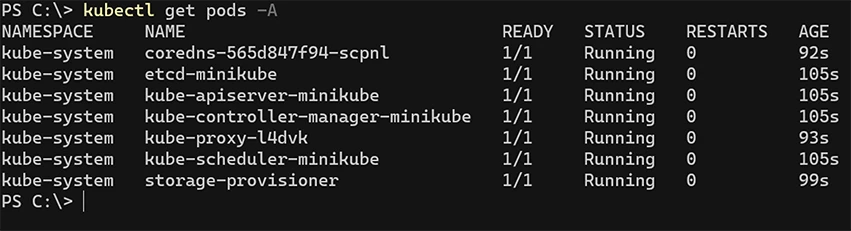

# Kubernetes - Como rodar localmente

## Requisitos

1 - Instalar o kubectl

  - Windows: https://kubernetes.io/docs/tasks/tools/install-kubectl-windows/
  - Linux: https://kubernetes.io/pt-br/docs/tasks/tools/install-kubectl-linux/
  - macOS: https://kubernetes.io/docs/tasks/tools/install-kubectl-macos/

2 - Instalar o Docker 

  - https://docs.docker.com/get-docker/

3 - Instalar o minikube:

```bash
$ minikube start
```

4 - Validar se a instalação do minikube foi feita com sucesso.

```bash
$ kubectl get pods -A
```

5 - Verifique se o minikube está como contexto padrão

```bash
$ kubectl config get-contexts
```
Obs: Se o minikube não estiver como contexto padrão, execute o comando abaixo para mudar:

```bash
$ kubectl config use-context minikube
```



## Executando o projeto

1 - No terminal, dentro da pasta do projeto, acesse a pasta kubernetes:

```bash
$ cd kubernetes
```
2 - Dê permissão para os arquivos deploy.sh e delete.sh

```bash
$ chmod +x deploy.sh
$ chmod +x delete.sh
```

3 - Para executar todos os arquivos *.yaml do projeto, execute o comando abaixo:

```bash
$ ./deploy.sh
```
4 - Após executar, verifique se os pods, svc, configmap, etc foram criados:

```bash
$ kubectl get pods -n maestro
$ kubectl get svc -n maestro
$ kubectl get configmap -n maestro
$ kubectl get secrets -n maestro
```
5 - Crie um túnel para acessar a api do projeto. Será fornecido um endereço IP para
acesso externo:

```bash
$ minikube service svc-maestro-app -n maestro --url
```
6 - Use a url informada para acesso da aplicação.

- Swagger: http://URL_INFORMADA/swagger-ui/

7 - Importe a collection no Insomnia que está a pasta "collections"

8 - Configure o baseUrl com a URL informada do environment do Insomnia.

9 - Para deletar todos os pods, services, etc, basta rodar o comando abaixo:

```bash
$ ./delete.sh
```